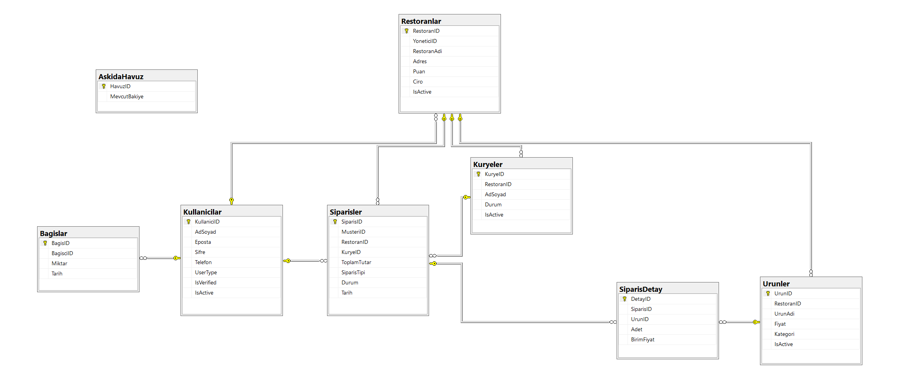

                                                                        İŞ KURALLARI 

1. Genel İş Kuralları
Soft-Delete Politikası: Sistemde hiçbir veri fiziksel olarak silinmez. Tüm tablolarda IsActive kolonu bulunur; silinmek istenen veri 0 olarak işaretlenerek pasifize edilir.

Referans Bütünlüğü: Tüm tablolar birbirine Foreign Key (Yabancı Anahtar) ile bağlıdır. İlişkisi kopuk (orphan) veri girişine izin verilmez.

Doğrulama (Constraints): Kullanıcıların e-posta ve telefon numaraları sistemde benzersiz (UNIQUE) olmalıdır. Sipariş tutarları ve ürün fiyatları her zaman 0'dan büyük (CHECK) olmalıdır.

2. Kullanıcı ve Restoran Modülü
Roller: Sistemde üç ana rol bulunur: Müşteri, Restoran ve Kurye.

Kurye İlişkisi: Her kurye belirli bir restorana bağlı çalışır (1:N İlişki). Bir restoranın birden fazla kuryesi olabilir.

Puanlama: Restoran puanları 1 ile 5 arasında sınırlıdır.

3. "Askıda Yemek" (Model B: Bakiye Bazlı) Modülü
Bağış Yapma: Herhangi bir kullanıcı, sisteme istediği miktarda para bağışı yapabilir. Bu bağışlar AskidaHavuz adlı merkezi bir bakiye tablosunda toplanır.

Gizlilik: Bağışçılar isterlerse kimliklerini gizleyerek (Anonim) bağış yapabilirler.

İhtiyaç Sahibi Doğrulaması: Sadece sistem yöneticisi tarafından IsVerified = 1 olarak onaylanmış kullanıcılar askıdaki bakiyeyi kullanabilir.

Otomasyon: Bir bağış yapıldığında havuz bakiyesi artar; askıdan bir sipariş verildiğinde ise havuz bakiyesi otomatik olarak düşer (Trigger ile kontrol edilir).

## 📐 Veritabanı Tasarımı (ER Diyagramı)
Sistemdeki tablo ilişkilerini ve kısıtlamaları (PK, FK, CHECK) gösteren diyagram aşağıdadır:

